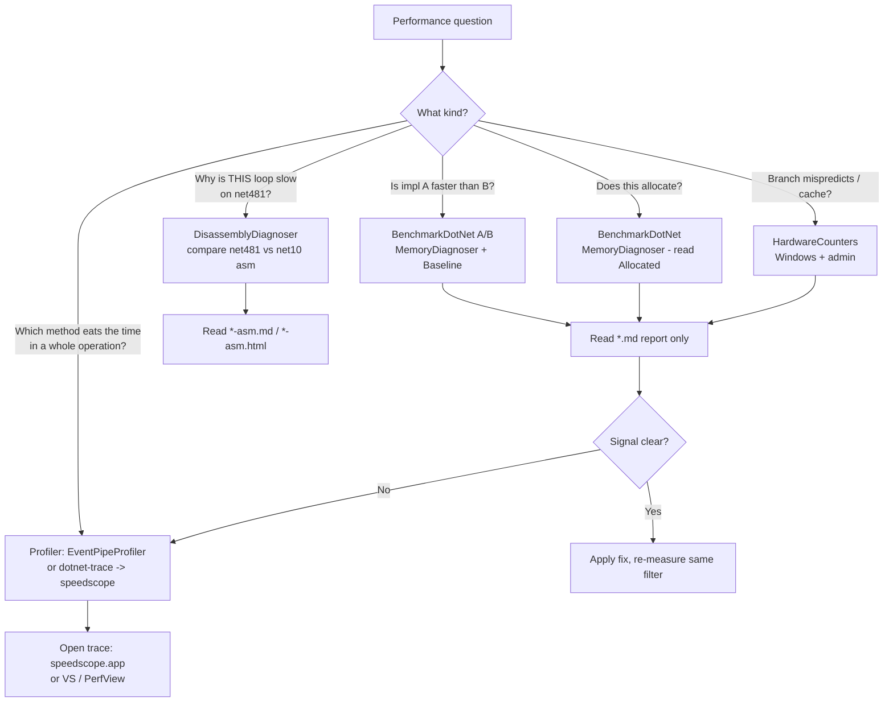

# Performance investigation guide

How to gather performance data with BenchmarkDotNet and turn it into a
concrete answer to "where is the time going, and what do I change?" This is a
field manual written for AI coding agents working in `touki`, optimized for
**effective, token-efficient** investigation: measure narrowly, read only the
artifacts that carry signal, and stop once the data points at a fix.

It complements three existing, more specific resources. Read this first to pick
a tool; drop into them for the mechanics:

- [`performance-testing`](../.agents/skills/performance-testing/SKILL.md) skill
  - authoring/running BenchmarkDotNet, `[MemoryDiagnoser]`, reading the table.
- [`framework-jit-optimization`](../.agents/skills/framework-jit-optimization/SKILL.md)
  skill - what to *change* once a `net481` loop is shown to be slow.
- [.github/instructions/perf.instructions.md](../.github/instructions/perf.instructions.md)
  - the non-negotiable conventions (Release-only, JIT-naming rule, regression
  threshold) every measurement in this repo must obey.
- [dotnet-perf-discoveries.md](dotnet-perf-discoveries.md) and
  [framework-span-performance.md](framework-span-performance.md) - the catalog
  of measured BCL behaviors. **Check these before measuring** - the answer may
  already be recorded.
- [arraypool-performance.md](arraypool-performance.md) and the
  [`scratch-buffer-strategy`](../.agents/skills/scratch-buffer-strategy/SKILL.md)
  skill - choosing a scratch buffer (zeroed `stackalloc` vs `[SkipLocalsInit]`
  vs `BufferScope<T>` vs an `ArrayPool` rental) and the net481/net10 size
  crossovers. Use the skill for the quick decision; the doc for the backing data.

---

## 0. TL;DR decision tree



Rule of thumb for picking the entry point:

| Question shape | Tool | Cost |
| --- | --- | --- |
| "A vs B", "did my change regress?" | BenchmarkDotNet `[Benchmark]` + `Baseline` | low |
| "Does X allocate? how much?" | BenchmarkDotNet `[MemoryDiagnoser]` | low |
| "Where in a multi-method operation is the time?" | `[EventPipeProfiler]` or `dotnet-trace` | medium |
| "Why does the JIT emit slow code here?" | `[DisassemblyDiagnoser]` | medium |
| "Is it branch misprediction / cache misses?" | `[HardwareCounters]` (Win+admin) | medium |
| "Does it leak / churn the GC over a long run?" | `dotnet-counters`, `dotnet-gcdump` | medium |

---

## 1. Token-efficient measurement protocol

The single biggest waste in an agent perf loop is running the whole benchmark
suite and pasting the whole console transcript back into context. Don't.

1. **Check the catalog first.** Grep [dotnet-perf-discoveries.md](dotnet-perf-discoveries.md)
   and [framework-span-performance.md](framework-span-performance.md) for the API
   or pattern. Many "valleys" and crossover thresholds are already measured and
   explained; re-deriving them burns tokens and CPU.
2. **Filter to one class or method.** Always pass `--filter` so only the
   relevant rows run. `--filter *MySubjectPerf*` for a class,
   `--filter *MySubjectPerf.Variant` for one method.
3. **Smoke first, then confirm.** Use `--job short` (or a `[ShortRunJob]`) for
   the first pass to validate the benchmark is well-formed and the direction of
   the result. Only drop `--job short` for the number you will quote.
4. **Read the file, not the scrollback.** BenchmarkDotNet writes a
   GitHub-flavored Markdown table to
   `BenchmarkDotNet.Artifacts/results/*-report-github.md`. Read that file (it is
   compact and already formatted) instead of scraping the console output. For an
   even tighter read, `grep` the columns you care about.
5. **Quote the minimum.** Report `Mean`, `Ratio`, and `Allocated` for the rows
   that changed. Do not paste environment banners, warnings, or unrelated rows.
6. **Re-measure with the identical filter** after a fix so the before/after is
   apples-to-apples. Name the TFM and JIT in the writeup (see the JIT-naming
   rule).

### Output artifact map (where the signal lives)

After any run, `BenchmarkDotNet.Artifacts/results/` contains:

| File | When to read it |
| --- | --- |
| `*-report-github.md` | **Default read.** Compact table for A/B and allocations. |
| `*-report.csv` | Diffing two runs programmatically. |
| `*-report-full.json` | Raw per-measurement data; only for statistical disputes. |
| `*-asm.md` / `*-asm.html` | `DisassemblyDiagnoser` output - the emitted asm. |
| `*.nettrace` / `*.etl` / `*.speedscope.json` | Profiler output - open in a viewer, don't read raw. |

Do **not** check these into git unless intentionally pinning a baseline
(per perf.instructions.md).

---

## 2. Layer 1 - BenchmarkDotNet (the default tool)

BenchmarkDotNet is the source of truth for every perf claim in this repo. The
[`performance-testing`](../.agents/skills/performance-testing/SKILL.md) skill has
the full authoring workflow; this section is the investigation-oriented summary.

### Run commands (from repo root, PowerShell)

```powershell
# A/B on modern .NET, one class, full confidence
dotnet run -c Release -f net10.0 --project touki.perf -- --filter *MySubjectPerf*

# Same on .NET Framework 4.8.1 (ALWAYS run both for cross-TFM code)
dotnet run -c Release -f net481 --project touki.perf -- --filter *MySubjectPerf*

# Fast smoke pass while iterating
dotnet run -c Release -f net10.0 --project touki.perf -- --filter *MySubjectPerf* --job short
```

`-c Release` is mandatory. `-f <tfm>` is mandatory (`touki.perf` multi-targets,
the SDK will not pick one). A regression on one TFM and not the other is real
signal, not noise.

### What the columns mean for an investigation

- **Mean** - the number you compare. **Median** is a sanity check; a large
  Mean/Median spread means the benchmark is unstable - fix it before drawing
  conclusions (usually a forgotten return value or per-call setup).
- **Ratio** - appears when one method is `[Benchmark(Baseline = true)]`. This is
  what you cite for "1.4x faster".
- **Allocated** - per-op managed bytes. `-` or `0 B` means allocation-free. Any
  new allocation in a documented hot path is a regression *regardless of
  throughput*. Always run with `[MemoryDiagnoser]`.
- **Gen0/1/2** - GC collections per 1000 ops. New Gen1/Gen2 promotion in a
  steady-state bench is a red flag even when `Allocated` looks small.

### The two failure modes that produce garbage numbers

1. **Returning `void` or an invariant constant** - dead-code elimination wipes
   the body. Symptoms: "optimized" variant slower than baseline, >50% StdDev,
   near-zero timings. Return a value derived from the work (for buffer-mutating
   APIs return `buffer[0]` or an XOR digest, never `buffer.Length`).
2. **Helper-method indirection** between the `[Benchmark]` and the
   system-under-test - the wrapper's call frame and type checks show up in the
   measurement. Rename one overload while measuring, or split into two classes.

### Regression threshold (from perf.instructions.md)

> Judge a delta against the benchmark's **own run-to-run noise**, not a fixed
> percentage. Establish the noise floor first (re-run the baseline, or read
> `Error`/`StdDev` - a clean microbench is usually stable to ~1-2 %). A
> *consistent* slowdown above that floor is a regression **even if it is under
> 5 %** - 5 % is not a free budget. Any new allocation in a hot path is a
> regression regardless of throughput. A **small throughput cost is acceptable
> when it buys an allocation reduction**: per-op `Mean` does not capture the
> amortized GC time the reclaimed bytes would have cost, so trading a few
> percent of `Mean` for materially fewer `Allocated` bytes is usually a net win.
> Always report the delta *and* the noise floor you measured it against, and
> name the TFM/JIT.

---

## 3. Layer 2 - finding *where* the time goes (profilers)

BenchmarkDotNet answers "how fast" and "how much allocated". When the operation
spans many methods and you need to know **which one** dominates, attach a
profiler. There are two paths: in-harness diagnosers and standalone tools.

### Profiling is part of the iteration loop, not a one-off

Treat a profile the way you treat the benchmark table: **capture it before and
after every change you intend to keep.** A before/after pair is what proves a
mitigation moved the bottleneck you thought it did - and, just as often, reveals
that it didn't (the wall-clock dropped but the call-tree shape is unchanged, so
the win came from somewhere other than your stated reason). The loop is:

1. Profile the baseline. Save the trace under a `before/` folder.
2. Apply one mitigation.
3. Profile again with the **identical filter**. Save under `after/`.
4. Diff the two flame graphs. Confirm the frame you targeted actually shrank.
5. Only then write the claim, and cite the before/after flame graphs.

Stash-and-reprofile is the cheap way to get a clean baseline when the change is
already in the working tree: `git stash push -- <file>`, rebuild, profile into
`before/`, `git stash pop`, rebuild, profile into `after/`.

### Profiler support by TFM (validated in this repo)

**The in-harness `EventPipeProfiler` / `--profiler EP` path is .NET-only.** It
is built on EventPipe, which does not exist on .NET Framework. Confirmed on this
repo: `dotnet run -f net481 ... --profiler EP` prints
`UnresolvedDiagnoser ... install the latest BenchmarkDotNet.Diagnostics.Windows
package` and produces **no** trace, while the same command on `-f net10.0`
writes a `.speedscope.json` with no admin and no extra package.

| Strategy | net10.0 | net481 |
| --- | --- | --- |
| `[EventPipeProfiler]` / `--profiler EP` | **Works, no admin, streamlined** | **Not supported** (EventPipe is Core-only) |
| `[EtwProfiler]` (`--profiler ETW`) | Works (Windows, admin) | **Works** (Windows, admin) - the net481 elevation path |
| `dotnet-trace` | Works (attaches via EventPipe) | Not supported (no EventPipe) |
| `[DisassemblyDiagnoser]` | Works | Works (this is how the net481 codegen findings were captured) |
| `[HardwareCounters]`, `InliningDiagnoser` | Works (Windows, admin) | Works (Windows, admin) |

**Default to net10.0 for the call-tree question.** Its EventPipe path needs no
admin, no extra package, and the structural answer (which method dominates,
which subtree is hot) is almost always TFM-independent - the *shape* of the
call tree is the algorithm, not the JIT. Use the net10.0 profile as the
structural map, and confirm the magnitude of the win on net481 with the
BenchmarkDotNet table (which **is** available on both TFMs).

Only reach for the **net481 elevation path** when you need on-CPU attribution
that the net10.0 shape cannot give you (e.g. you suspect the cost is
net481-specific slow-span indexing inside one method, not a different call
tree). That path is `[EtwProfiler]`:

- add the `BenchmarkDotNet.Diagnostics.Windows` package and **consume one of its
  public types** so MSBuild copies it to the output (or set
  `<CopyLocalLockFileAssemblies>true</CopyLocalLockFileAssemblies>`) - without
  this the diagnoser silently falls back to `UnresolvedDiagnoser`;
- run the shell **as Administrator**;
- open the resulting `.etl` in PerfView or WPA.

For a pure net481 codegen question (the common case here), prefer
`[DisassemblyDiagnoser]` (&sect;4) over ETW - it needs no admin and answers
"why is this loop slow" directly.

### 3a. In-harness: `EventPipeProfiler` (cross-platform, no admin)

The lowest-friction way to get a call-tree for a benchmark. Add the attribute
to the benchmark class:

```c#
using BenchmarkDotNet.Diagnosers;

[MemoryDiagnoser]
[EventPipeProfiler(EventPipeProfile.CpuSampling)] // also: GcVerbose, GcCollect, Jit
public class MySubjectPerf
{
    [Benchmark]
    public int Subject() => /* ... */;
}
```

It writes a `.speedscope.json` (and `.nettrace`) under
`BenchmarkDotNet.Artifacts/`. Open the speedscope file at
<https://www.speedscope.app/> (drag-drop, nothing to install) to get a flame
graph. Cross-platform, works on Linux/macOS/Windows, **no admin required**.

#### One command: run + profile + ranked hotspots

For an agent, the fastest loop is the committed wrapper, which runs the
benchmark under EventPipe, finds the freshest trace, and prints folded
self-time and inclusive-time rankings (and optionally a flame-graph SVG) - no
GUI, no PerfView:

```powershell
# Run the benchmark under EventPipe, then print accurate hotspot rankings.
./tools/Profile-Benchmark.ps1 `
    -Filter '*MsBuildEnumeratePerf3.GlobEnumeratorExtGlobSingleWithRoot' `
    -RootFrame 'RecordedDirectoryEnumerator.MoveNext' `
    -OutSvg scratch/extglob.svg          # SVG is optional

# Already have a fresh trace? Re-aggregate without re-running:
./tools/Profile-Benchmark.ps1 -Filter '*GlobEnumeratorExtGlobSingleWithRoot' `
    -RootFrame 'RecordedDirectoryEnumerator.MoveNext' -SkipRun

# Or analyze a specific trace directly:
./tools/Get-TraceHotspots.ps1 `
    -Path BenchmarkDotNet.Artifacts/<trace>.speedscope.json `
    -RootFrame 'RecordedDirectoryEnumerator.MoveNext'
```

Three committed scripts back this:

- `tools/Profile-Benchmark.ps1` - the wrapper above (net10.0-only; refuses
  net481).
- `tools/Get-TraceHotspots.ps1` - aggregates a `.speedscope.json` into
  self-time and inclusive rankings, **folding the JIT-helper sampling
  artifacts** (see below) into the real method. `-CallersOf <frame>` reports
  who calls a given frame, to confirm what an artifact is attributable to.
- `tools/speedscope-to-flamegraph.ps1` - renders an inclusive flame-graph SVG.

> **Reading the BenchmarkDotNet speedscope export - two traps.**
>
> **Trap 1: the synthetic `CPU_TIME` leaf.** The trace is an *evented* profile
> whose leaf self-time is bucketed into a synthetic `CPU_TIME` (or
> `UNMANAGED_CODE_TIME`) node, so a naive "top self-time" aggregation is
> useless - every managed leaf reads as `0 ms`. The **inclusive call tree is
> the real signal**, and it is exactly what a flame graph renders: read the
> inclusive percentages per frame and follow the widest path down.
>
> **Trap 2: JIT-helper thunks masquerading as the hotspot.** EventPipe's stack
> walk is **managed-only**. When a sample's instruction pointer lands inside a
> JIT helper - a write barrier, a `Buffer.Memmove`, or the GC-poll thunk
> RyuJIT emits at loop back-edges - the walker resolves the *leaf* to that
> helper (`System.Buffer.BulkMoveWithWriteBarrier`, `Thread.PollGCWorker`, ...)
> rather than the method whose hot loop is actually running. Such a frame then
> appears, misleadingly, to dominate self-time *and* inclusive-time. Two tells
> that a frame is an artifact, not a real cost:
>
> - It copies/marshals data that provably has no GC references. A
>   `Span<T>.CopyTo` over a `struct` with no reference fields compiles to plain
>   `Buffer.Memmove`, **never** `BulkMoveWithWriteBarrier` (that helper requires
>   `RuntimeHelpers.IsReferenceOrContainsReferences<T>()`), so seeing the
>   write-barrier variant over a ref-free struct is impossible for a real call.
> - It appears as a *direct* child of a hot loop method, bypassing the
>   intermediate frames a real call would pass through.
>
> The cycles are real - they belong to the enclosing loop - but the *label* is
> wrong. `Get-TraceHotspots.ps1` folds these (default patterns: `CPU_TIME`,
> `UNMANAGED_CODE_TIME`, `BulkMoveWithWriteBarrier`, `PollGC`, `Memmove`,
> `WriteBarrier`, `JIT_`) back into the nearest non-folded ancestor, which is
> the PerfView `/FoldPats` operation done headless. In the extglob case the
> folded view reattributed a "93% `BulkMoveWithWriteBarrier`" reading to its
> true owners: the two engine loop bodies `RunEngine` (50.9%) and
> `RunEngineDirectory` (42.2%), pure compute, no copies.

> **`-RootFrame` gotcha.** BenchmarkDotNet wraps the workload in an
> `Activity Benchmark(...benchmarkName=Foo...)` frame whose **name contains the
> benchmark method name**. Scoping with the method name as `-RootFrame`
> therefore also matches that wrapper and pulls idle threadpool threads into the
> ranking. Scope to a frame *inside* the workload instead (an enumerator
> `MoveNext`, or the first method unique to the system under test).

`EventPipeProfile` values worth knowing:

- `CpuSampling` - "where is on-CPU time spent" (the usual first question).
- `GcVerbose` - allocation call sites and GC pauses (pairs with a high
  `Allocated` from the memory diagnoser to find *which* call allocates).
- `Jit` - JIT compilation events.

### 3b. In-harness: `EtwProfiler` (Windows, admin, richest data)

```c#
[EtwProfiler] // Windows only, requires running the shell as Administrator
public class MySubjectPerf { /* ... */ }
```

Emits an `.etl` with full stacks plus GC/JIT/CLR events and the PDBs to resolve
symbols. Open in **PerfView** or **Windows Performance Analyzer**. Use this when
EventPipe's managed-only view is not enough (e.g. you suspect time in native
runtime code). `NativeMemoryProfiler` and `ConcurrencyVisualizerProfiler` are
built on the same ETW path.

### 3c. Standalone: `dotnet-trace` (any process, no benchmark needed)

When the hot path lives in a running app / test / sample rather than a
benchmark, profile the live process. Install once:

```powershell
dotnet tool install --global dotnet-trace
```

Collect a CPU-sampled trace and convert to a flame graph:

```powershell
# List candidate processes
dotnet-trace ps

# Sample thread stacks for a running PID, write speedscope directly
dotnet-trace collect --process-id <PID> --format Speedscope

# Or launch + trace a self-contained app from startup
dotnet-trace collect --format Speedscope -- dotnet exec MyApp.dll arg1
```

Notes from the current docs:

- The default (no `--profile`) is `dotnet-common` + `dotnet-sampled-thread-time`.
  The old `cpu-sampling` profile name was removed; for CPU hotspots use
  `--profile dotnet-sampled-thread-time,dotnet-common`.
- `--format Speedscope` -> open at <https://www.speedscope.app/>. On Windows you
  can instead open the `.nettrace` directly in Visual Studio or PerfView.
- `dotnet-trace report <file> topN --inclusive` prints the top-N methods by time
  to stdout - a **token-cheap** way for an agent to get the hot methods without
  opening a GUI.

### 3d. Standalone: live counters and GC dumps

- `dotnet-counters monitor --process-id <PID>` - live CPU, alloc rate, GC, JIT,
  thread-pool, exception counters. Good for "is it allocating in steady state".
- `dotnet-gcdump collect -p <PID>` - heap snapshot to diagnose what is retained
  (open in Visual Studio or PerfView).
- `dotnet-dump` - full process dump for post-mortem analysis with `dotnet dump
  analyze` (SOS commands like `dumpheap -stat`).

### 3e. Getting more accurate samples (without ETW)

EventPipe's `CpuSampling` profile samples at a fixed **~100 Hz** (one sample per
managed thread roughly every 10 ms). It is a *managed-only, thread-time* walker:
it cannot see native frames, and on a short benchmark you simply get too few
samples for a stable ranking. Levers that actually help, cheapest first:

- **Lengthen the measured work, not the sample rate.** On **net10 you cannot
  raise the rate** - `DOTNET_EventPipeThreadSamplingRate` is **.NET 11+ only**.
  More samples means a longer workload at the fixed 100 Hz: profile a larger
  input, or wrap the body in an inner loop. BenchmarkDotNet's own iteration
  count already helps; an operation that runs for seconds (like the 25 s
  extglob enumeration here) yields thousands of samples and a stable tree.
- **Fold the artifacts** (section 3a, Trap 2). This is the single biggest
  accuracy win for *attribution* and costs nothing - `Get-TraceHotspots.ps1`
  does it by default.
- **Split a suspect frame with `[MethodImpl(MethodImplOptions.NoInlining)]`.**
  If two methods are inlined together the sampler cannot tell them apart;
  temporarily disabling inlining on one gives it its own frame and confirms the
  split. Remove it afterwards - it changes the codegen you are measuring.
- **`dotnet-trace report <file> topN --inclusive`** prints the ranked methods to
  stdout - token-cheap for an agent, and it reads the same `.nettrace`.
- **PerfView headless** (`PerfView /FoldPats=... stacks ...`) does the same fold
  the script does, with richer grouping, when you already have PerfView. The
  committed script exists so the common case needs neither PerfView nor a GUI.
- **Want true CPU time and native frames?** EventPipe gives neither. On Windows
  use `[EtwProfiler]` (section 3b, admin). On Linux - including **WSL Ubuntu on
  this machine** (see the `run-tests-on-wsl` skill) - `dotnet-trace collect`
  with the Linux CPU event, or `perf` + the runtime's perfmap, gives real
  on-CPU sampling with native frames.

#### Should I stabilize the JIT first?

Stabilize the JIT **for clean attribution, not for absolute numbers**:

- For a *flame graph / where-is-the-time* question, a stable call tree is what
  you want; tiered compilation re-JITting mid-run can smear samples across the
  tier-0 and tier-1 versions of a method. BenchmarkDotNet's warmup already lands
  the steady-state iterations on tier-1 code, so the default harness is usually
  stable enough - check the warmup output settled before trusting the tree.
- Setting `DOTNET_TieredCompilation=0` (or `<TieredCompilation>false</...>`)
  forces full opts from the first call and removes tier transitions, which makes
  the trace cleaner - **but it is not the code your users run** (they get
  tiering), so never read *absolute* timings from a `TieredCompilation=0` run
  and treat them as production. Use it only to sharpen *attribution*, then drop
  it.
- Do **not** chase JIT stability for a microbenchmark whose numbers you care
  about - measure those with the normal tiered harness.

---

## 4. Layer 3 - why the JIT emits slow code (disassembly)

When a tight loop is slower than it "should" be - especially the recurring
`net481` story - read the actual machine code.

```c#
using BenchmarkDotNet.Diagnosers;

[DisassemblyDiagnoser(printSource: true, maxDepth: 3)]
public class MySubjectPerf { /* ... */ }
```

Requirements and tips:

- .NET Core disassembler works on Windows; target **AnyCPU**
  (`<PlatformTarget>AnyCPU</PlatformTarget>`) to compare platforms.
- For C#/IL interleaving set `<DebugType>pdbonly</DebugType>` and
  `<DebugSymbols>true</DebugSymbols>`.
- Output lands in `*-asm.md` / `*-asm.html`. Read the `.md`.
- To get the asm **without** a long run, combine with `[DryJob]` - it runs once.

This is the tool behind the discoveries in
[framework-span-performance.md](framework-span-performance.md) (slow-span layout,
the `cmp ecx, 0xFFFFFFFF` sign-extension foot-gun). When you suspect a
`net481`-specific codegen issue, capture the asm on **both** TFMs and diff -
the `framework-jit-optimization` skill explains what the differences mean and
what to change.

Related diagnosers (all Windows + `BenchmarkDotNet.Diagnostics.Windows`):

- `InliningDiagnoser` - which calls were/weren't inlined (the net481 inliner is
  conservative; this confirms a missing `[MethodImpl(AggressiveInlining)]`).
- `TailCallDiagnoser`, `JitStatsDiagnoser` - JIT behavior detail.
- `[HardwareCounters(HardwareCounter.BranchMispredictions, ...)]` - branch
  misprediction / cache-miss counts; the canonical sorted-vs-unsorted branch
  case. Windows 8+, admin, no Hyper-V.

---

## 5. IDE and editor tooling

### Visual Studio (richest GUI, Windows)

`Debug > Performance Profiler` (Alt+F2) bundles the tools an agent would
otherwise wire up by hand:

- **CPU Usage** - sampling profiler with a call tree and "hot path".
- **.NET Object Allocation Tracking** - every allocation and its stack; the GUI
  equivalent of `EventPipeProfile.GcVerbose`.
- **Database**, **Instrumentation** (exact call counts), **GPU**, **Events**.
- Opens `.nettrace`, `.etl`, and `.diagsession` files captured elsewhere.

Best when a human is driving and wants to click through a flame graph. For an
automated agent loop, the BenchmarkDotNet diagnosers and `dotnet-trace report
topN` give the same answers in text.

### VS Code

There is **no built-in .NET sampling-profiler UI** in C# Dev Kit today. The
practical VS Code workflow is:

- Run `dotnet-trace` / `dotnet-counters` from the integrated terminal (sections
  3c/3d) and open the resulting speedscope file in a browser.
- Install the standalone tools as global dotnet tools; they need no extension.
- For allocation/CPU GUIs, VS Code users typically hand the `.nettrace`/`.etl`
  to Visual Studio or PerfView, or use the web speedscope viewer.

### JetBrains (cross-platform, if available)

- **dotTrace** - sampling/tracing/timeline CPU profiler.
- **dotMemory** - allocation and retention profiler with snapshot diffing.

Mention these as alternatives; they are not part of this repo's toolchain and
require a license. Don't assume they're installed.

### PerfView (free, Windows, deep)

Microsoft's free ETW analyzer. The go-to for `.etl` from `EtwProfiler` and for
GC-heavy investigations (GCStats, allocation-tick stacks). Steeper UI than VS
but unmatched depth. Pairs with `dotnet-trace`'s `.nettrace` output too.

---

## 6. MCP servers and programmatic API access

There is **no dedicated .NET profiling MCP server** in this workspace, and none
is an industry standard at time of writing. Profiling is done with the CLI tools
and diagnosers above. The MCP/API surfaces that *do* help an agent's perf work
are research-oriented:

- **Microsoft Learn MCP** (`microsoft_docs_search`, `microsoft_docs_fetch`) -
  authoritative, current docs for `dotnet-trace`, `dotnet-counters`,
  EventPipe, diagnosers, and runtime event providers. Use it to confirm flags
  and profile names instead of guessing (they change between SDK versions - e.g.
  the `cpu-sampling` profile rename).
- **apisofdotnet MCP** (`mcp_apisofdotnet_*`) - which APIs exist on which TFM,
  extension-method lookup, usage sources. Useful when deciding whether a faster
  BCL primitive is even available on `net481`.
- **GitHub MCP / PR tools** - pull prior benchmark numbers out of merged PR
  descriptions in this repo to avoid re-measuring a known result.

If you reach for an MCP "profiler", stop - there isn't one; use a diagnoser or
`dotnet-trace`.

---

## 7. End-to-end investigation playbook

A concrete, token-efficient loop an agent should follow:

1. **Frame the question** as one of the rows in the &sect;0 table. If it's "A vs
   B" or "does it allocate", you never leave Layer 1.
2. **Search the catalog** ([dotnet-perf-discoveries.md](dotnet-perf-discoveries.md),
   [framework-span-performance.md](framework-span-performance.md)) for the API or
   pattern. Cite the existing measurement if found and stop.
3. **Write or locate a benchmark** in `touki.perf/` (`<Subject>Perf` class,
   `[MemoryDiagnoser]`, a `Baseline`, every method returns a real value).
4. **Smoke** with `--job short --filter *<Subject>Perf*` on `net10.0`. Confirm
   the benchmark is well-formed (stable Mean/Median, sane direction).
5. **Confirm** on both TFMs without `--job short`. Read
   `*-report-github.md`, quote only `Mean`/`Ratio`/`Allocated` for changed rows.
6. **If the bottleneck is unclear**, attach `[EventPipeProfiler(CpuSampling)]`
   and run `./tools/Profile-Benchmark.ps1 -Filter *<Subject>* -RootFrame
   <workload-frame>` on **net10.0** for ranked, artifact-folded hotspots in one
   command (or `dotnet-trace ... report topN`). **Fold the JIT-helper artifacts**
   (`BulkMoveWithWriteBarrier`, `PollGC`, the synthetic `CPU_TIME` leaf) before
   trusting any self-time number - the script does this by default; see &sect;3a
   Trap 2. Profiling is part of the loop: capture a `before/` trace, apply the
   fix, capture an `after/` trace with the identical filter, and diff. EventPipe
   is net10.0-only; for net481 on-CPU attribution use `[EtwProfiler]` (admin) -
   see the per-TFM table in &sect;3.
7. **If a specific loop is slow**, attach `[DisassemblyDiagnoser]` on both TFMs
   and diff the asm; consult `framework-jit-optimization` for the fix.
8. **Apply the fix, re-measure with the identical filter.** Name the TFM and
   JIT ("modern .NET RyuJIT" / ".NET Framework 4.8.1 RyuJIT") in the writeup.
9. **Record durable findings** in [dotnet-perf-discoveries.md](dotnet-perf-discoveries.md)
   if the result is a reusable BCL/JIT behavior, so the next investigation skips
   straight to step 2.

### Anti-patterns (token and CPU waste)

- Running the full suite when one `--filter` would do.
- Pasting console banners/warnings/unrelated rows into context instead of
  reading `*-report-github.md`.
- Measuring in Debug (numbers are meaningless; BenchmarkDotNet warns).
- Quoting an unqualified "RyuJIT" result - half the time it's wrong about which
  JIT. Always name the TFM.
- Reaching for a profiler before BenchmarkDotNet has even confirmed there's a
  regression to chase.
- Trusting a single noisy run with a large Mean/Median spread - fix the
  benchmark first.

---

## 8. Quick reference card

```text
A/B + allocations ............ dotnet run -c Release -f <tfm> --project touki.perf -- --filter *X*
Fast smoke ................... add --job short
Read the result .............. BenchmarkDotNet.Artifacts/results/*-report-github.md
Where's the time? (one cmd) .. ./tools/Profile-Benchmark.ps1 -Filter *X* -RootFrame <workload-frame>
                               runs [EventPipeProfiler] + folds JIT-helper artifacts + ranks. net10 only.
                               -OutSvg writes a flame graph; -SkipRun re-aggregates an existing trace.
Analyze an existing trace .... ./tools/Get-TraceHotspots.ps1 -Path *.speedscope.json -RootFrame <frame>
                               -CallersOf <frame> confirms what a helper artifact is attributable to.
Where's the time? (in-harness) [EventPipeProfiler(EventPipeProfile.CpuSampling)] -> speedscope.app
                               net10.0 only (no admin); net481 needs [EtwProfiler] (admin) -> .etl
                               FOLD BulkMoveWithWriteBarrier/PollGC/CPU_TIME before reading self-time.
Where's the time? (live proc)  dotnet-trace collect -p <PID> --format Speedscope
                               dotnet-trace report <file> topN --inclusive   (text, token-cheap)
Why slow codegen? ............ [DisassemblyDiagnoser(printSource:true)] -> *-asm.md  (diff TFMs)
Inlined or not? .............. [InliningDiagnoser]  (Windows pkg)
Branch/cache? ................ [HardwareCounters(...)]  (Windows, admin)
Live GC/alloc rate ........... dotnet-counters monitor -p <PID>
Heap retention ............... dotnet-gcdump collect -p <PID>  (open in VS/PerfView)
GUI flame graph .............. VS Performance Profiler (Alt+F2) | PerfView | speedscope.app
Confirm a flag/profile ....... Microsoft Learn MCP (docs change between SDKs)
```

Remember the two hard rules from
[perf.instructions.md](../.github/instructions/perf.instructions.md): **Release
only**, and **name the JIT** in every claim.
