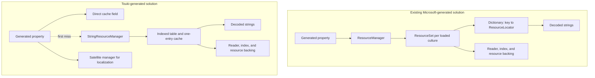

# Generated string resource solution

## Executive decision

**Ship the Touki-generated solution.** It trades a small fixed property-slot
cache for materially faster access and lower memory once an application uses a
meaningful portion of a resource class.

For the measured Microsoft.Build-sized workload - 651 properties across a
587-string main table and a 64-string shared table - the decision is:

| Decision point | Existing Microsoft-generated path | Touki-generated path |
| --- | ---: | ---: |
| Warm property, modern .NET RyuJIT | 27.458 ns / 0 B | **0.588 ns / 0 B** |
| Warm property, .NET Framework 4.8.1 RyuJIT | 47.792 ns / 0 B | **2.109 ns / 0 B** |
| Cache metadata after one key in each table | **about 480 B** | about 5,320 B |
| Fully populated comparable runtime cache | about 169 KiB | **about 138 KiB** |
| Runtime DLL growth | - | 0.245-0.676% |
| NuGet package growth | - | 28,326 B / 1.841% |
| ReadyToRun code growth in rooted probe | - | 0 B |
| Native AOT executable in rooted probe | 2,173,440 B | **1,329,152 B** |

The memory tradeoff is straightforward:

- **Sparse access favors the existing path.** With one key read from each table,
  its comparable dictionary metadata is about 480 B. Touki has already allocated
  5,256 B of generated property slots plus up to 64 B for two manager last-entry
  caches.
- **Broad access favors Touki.** Once the main table reaches about 90 distinct
  cached keys, the BCL dictionary takes its next capacity step and exceeds the
  generated main-table cache. With both tables fully populated, Touki saves about
  31,232 B, or 18%, in the comparable retained cache.
- **Decoded strings cost the same in both designs.** The saving comes from
  replacing BCL dictionaries and `ResourceLocator` entries with generated
  reference fields.
- **The Native AOT result is application-specific.** The measured executable is
  844,288 B smaller because this rooted Touki path does not retain the BCL
  `ResourceManager` closure.

## End-to-end solution map

The source generators execute inside the compiler. Neither generator assembly is
loaded by the application at runtime. Compiler peak memory was not measured; the
map below covers the memory retained by the **generated runtime solutions**.



### Runtime memory by layer

The table uses the two Microsoft.Build resource classes and one active culture.
"Modeled" figures use verified dictionary capacities and x64 object layouts.

| Runtime layer | Existing Microsoft-generated path | Touki-generated path | Treatment |
| --- | ---: | ---: | --- |
| Source-generator assembly | 0 B in application | 0 B in application | Compiler-only |
| Generated property-slot object | none | 5,256 B | Fixed after both classes initialize |
| Lookup metadata, one key per table | about 480 B | up to 64 B | Modeled; excludes property slots |
| Lookup metadata, all 651 keys | about 36,552 B | up to 64 B | Modeled; excludes property slots |
| Decoded strings, all 651 values | about 136,432 B | about 136,432 B | Same payload model |
| **Comparable full-cache subtotal** | **172,984 B / 169 KiB** | **141,752 B / 138 KiB** | Property/value caching only |
| Manager and culture objects | Additional | Additional | Not separately measured |
| Reader, index, manifest/mapped backing | Additional | Additional | Deployment-dependent |
| Satellite assemblies or external files | Additional | Additional | Deployment-dependent |

The comparable subtotal is deliberately not presented as total process memory.
A byte-accurate whole-process total would require a retained-object-graph
measurement for a specific deployment, culture sequence, and runtime. The map
makes those additional layers visible instead of hiding them inside the cache
number.

### Lifecycle view

| Lifecycle event | Existing Microsoft-generated path | Touki-generated path |
| --- | --- | --- |
| Type initialization | Lazy manager; no property cache | Allocates the reference-slot cache |
| First property | Manager, set, dictionary, decoded value | Manager, index, decoded value, property field |
| More properties | Dictionary and locators grow | Existing fields are filled |
| Warm property | Manager call and dictionary lookup | Direct field read |
| Culture change | May retain a set and dictionary per culture | Replaces values; source state may remain |
| Release | Clears sets and value dictionaries | Clears source state; fields remain |

## Top-level design

The design has three layers:

1. `StringResourceManager` owns one neutral table. It validates type codes once,
   searches the compiled resource index, and decodes only requested strings.
2. `SatelliteStringResourceManager` adds exact, parent, missing-culture, and
   neutral fallback. Generated localized accessors use runtime satellites.
3. The generator emits a static partial accessor with a nested cache containing
   the selected `CultureInfo` and one nullable field per generated property.

The first property read follows the manager/index path and stores the resolved
string in its generated field. Later reads do not hash a key, search an index,
or call the manager. Assigning `Culture` replaces the complete generated cache
object in constant time.

## Performance

### Actual generated property

Retained default-job results over Touki's embedded resource table:

| Runtime | BCL manager | Touki manager | Generated property |
| --- | ---: | ---: | ---: |
| modern .NET RyuJIT | 27.458 ns / 0 B | 1.559 ns / 0 B | 0.588 ns / 0 B |
| .NET Framework 4.8.1 RyuJIT | 47.792 ns / 0 B | 4.802 ns / 0 B | 2.109 ns / 0 B |

The generated property is about 47x faster than BCL on modern .NET RyuJIT and
about 23x faster on .NET Framework 4.8.1 RyuJIT.

### MSBuild-scale property batch

Eight representative properties from Microsoft.Build's 587-string table:

| Runtime | BCL wrapper | Uncached Touki wrapper | Generated cache |
| --- | ---: | ---: | ---: |
| modern .NET RyuJIT | 278.598 ns / 0 B | 474.895 ns / 2,744 B | 1.988 ns / 0 B |
| .NET Framework 4.8.1 RyuJIT | 455.207 ns / 0 B | 1,490.212 ns / 2,768 B | 8.944 ns / 0 B |

Generated caching is 51-140x faster than the BCL wrapper and 167-239x faster
than uncached Touki properties for this batch.

### First access

Replacing the generated cache costs 48 B. With the manager already holding the
same key, replacing the cache and populating one property costs 4.853 ns / 48 B
on modern .NET RyuJIT and 9.982 ns / 48 B on .NET Framework 4.8.1 RyuJIT.

An intentionally adverse alternating-key benchmark costs 84.662 ns / 232 B and
270.873 ns / 241 B respectively. This includes decoding two strings. Only one
32-byte manager `CacheEntry` per property is redundant after the generated field
is populated. Touki retains the manager's one-entry cache because bypassing it
would add another lookup contract and weaken direct-manager locality for a
one-time 32-byte saving.

## Memory model

There are three distinct memory costs:

1. **Cache metadata:** references, dictionary entries, buckets, and cache
   objects.
2. **Decoded strings:** the actual managed `string` objects retained after
   lookup.
3. **Resource backing:** manifest memory, mapped files, streams, indexes, and
   culture/source state.

The first two are modeled below. Resource backing is deliberately excluded from
the comparison because both approaches retain a source and because its size
depends on deployment mode.

The 169 KiB BCL figure is therefore **not** the complete memory footprint of a
`ResourceManager`. It is the comparable string-cache slice. A complete process
also pays for `ResourceManager`, each loaded `ResourceSet`, per-culture maps,
readers, resource indexes, and the underlying resource or satellite backing.

### Generated cache metadata

On x64, the generated cache object is modeled as:

$$
\operatorname{align}_8(16 + 8(N + 1))
$$

where 16 B is the object header, $N$ is the property count, and the extra
reference stores `Culture`.

| Table | Properties | Generated cache object |
| --- | ---: | ---: |
| Microsoft.Build main | 587 | 4,720 B |
| Microsoft.Build shared | 64 | 536 B |
| **Combined** | **651** | **5,256 B / 5.13 KiB** |

This memory is fixed once both generated classes initialize, even if only one
property is read. Only accessed values occupy the slots. Each underlying Touki
manager can additionally retain one 32-byte last-entry object, so two active
managers bring steady cache metadata to about 5,320 B.

### BCL `ResourceManager` cache metadata

`RuntimeResourceSet` keeps a `Dictionary<string, ResourceLocator>` per loaded
resource set. A string lookup stores the data position and retains the decoded
value in `ResourceLocator.Value`; values remain cached until resources are
released.

For an x64 model:

- each dictionary entry is approximately 32 B: hash, next index, key reference,
  and the 16-byte `ResourceLocator`;
- each bucket is 4 B;
- array headers are 24 B; and
- the dictionary object is approximately 80 B.

Normal dictionary growth was verified at capacity 919 for 587 entries and 89
for 64 entries. The corresponding metadata is:

| Table | Dictionary capacity | BCL cache metadata |
| --- | ---: | ---: |
| Microsoft.Build main | 919 | about 33,216 B |
| Microsoft.Build shared | 89 | about 3,336 B |
| **Combined** |  | **about 36,552 B / 35.70 KiB** |

This dictionary cost grows stepwise with the number of distinct accessed keys.
It can be lower than the generated 5.13 KiB fixed cost when an application reads
only a small number of properties. For the main table, the dictionary metadata
overtakes the generated cache at roughly 90 distinct cached keys.

| Distinct keys in one resource set | Capacity | Approximate BCL metadata |
| ---: | ---: | ---: |
| 0 | 0 | 80 B |
| 1-3 | 3 | 240 B |
| 4-7 | 7 | 384 B |
| 8-17 | 17 | 744 B |
| 18-37 | 37 | 1,464 B |
| 38-89 | 89 | 3,336 B |
| 90-197 | 197 | 7,224 B |
| 198-431 | 431 | 15,648 B |
| 432-919 | 919 | 33,216 B |

Generated wrappers pass literal keys, so the model does not charge additional
key-string objects to BCL. Dynamic callers can cause BCL to retain caller-owned
key strings, increasing its retained memory.

### Decoded string payload

Both strategies retain every decoded property value. A representative x64
string size is:

$$
\operatorname{align}_8(22 + 2L)
$$

where $L$ is the UTF-16 character count. Using the measured average values of
about 92 characters for the main table and 99 for the shared table, fully
populating all 651 values retains approximately 133 KiB of decoded strings.

| Fully populated cache | Metadata | Decoded values | Approximate total |
| --- | ---: | ---: | ---: |
| BCL `ResourceManager` | 35.70 KiB | 133 KiB | 169 KiB |
| Generated + Touki managers | 5.20 KiB | 133 KiB | 138 KiB |

The generated solution therefore saves about 30.5 KiB, or 18%, in this fully
populated two-table model. More importantly, it replaces hash-table traversal
with direct field access. The tradeoff is paying 5.13 KiB up front even when few
properties are used.

### Culture and release lifetime

- BCL `ResourceManager` can retain a `ResourceSet`, dictionary, and decoded
  values for every loaded culture until `ReleaseAllResources()`.
- The generated property cache represents one selected culture per generated
  class. Setting `Culture` drops the old cache reference, making its property
  values collectible.
- Calling the generated `ResourceManager.ReleaseAllResources()` releases manager
  source state but does **not** invalidate generated property fields. Assign
  `Culture` to replace the generated cache.
- The underlying satellite manager can still retain loaded culture/source state
  until released. That state is outside the property-cache figures above.

## Build and deployment cost

| Artifact | Baseline | Generated solution | Delta |
| --- | ---: | ---: | ---: |
| net10.0 `touki.dll` | 625,664 B | 627,712 B | +2,048 B / +0.327% |
| net11.0 `touki.dll` | 626,176 B | 627,712 B | +1,536 B / +0.245% |
| net472 `touki.dll` | 908,288 B | 914,432 B | +6,144 B / +0.676% |
| NuGet package | 1,538,989 B | 1,567,315 B | +28,326 B / +1.841% |

The generated getter is 21 IL bytes versus 12 for the pinned Microsoft
generator. Each generated class adds one 38-byte shared helper. Across Touki's
85 production properties and two resource classes, getter/helper IL is 1,861 B
versus 1,020 B for the pinned getter bodies.

### Getter IL reduction investigation

The benchmark reads eight properties. The **warm** rows read populated fields;
the **first** rows replace only the generated cache and repopulate all eight
fields over a warm manager. Allocation is unchanged between compared shapes.

#### Former inline getter: 41 IL bytes

```csharp
public static string ErrorString =>
  s_cache.ErrorString ??= GetResourceString(nameof(ErrorString), Culture);
```

This repeated the null test, manager call, and store lowering in every getter.

#### `ref` local: 38 IL bytes

```csharp
public static string ErrorString
{
  get
  {
    ref string? value = ref s_cache.ErrorString;
    return value ??= GetResourceString(nameof(ErrorString), Culture);
  }
}
```

This retains the existing lookup helper and call graph. It saves 3 bytes per
property and needs no additional method.

| Runtime | Current warm | `ref` warm | Current first | `ref` first | First allocation |
| --- | ---: | ---: | ---: | ---: | ---: |
| modern .NET RyuJIT | 4.382 ns | 4.371 ns | 605.549 ns | 660.211 ns | 7,464 B |
| .NET Framework 4.8.1 RyuJIT | 7.529 ns | 7.503 ns | 1,634.697 ns | 1,628.954 ns | 7,503 B |

These are retained default-job results. Framework is equivalent in both phases;
modern first population is 9.0% slower.

#### Inline fast path, outlined cold load: 35 IL bytes + 36-byte helper

```csharp
public static string ErrorString
{
  [MethodImpl(MethodImplOptions.AggressiveInlining)]
  get => s_cache.ErrorString
    ?? LoadResourceString(ref s_cache.ErrorString, nameof(ErrorString));
}

[MethodImpl(MethodImplOptions.NoInlining)]
private static string LoadResourceString(ref string? value, string name)
{
  value = ResourceManager.GetString(name, Culture)
    ?? throw new MissingManifestResourceException();
  return value;
}
```

The matched short-job comparison marked both current and candidate getters for
aggressive inlining, isolating the outlined cold path:

| Runtime | Current warm | Outlined warm | Current first | Outlined first | First allocation |
| --- | ---: | ---: | ---: | ---: | ---: |
| modern .NET RyuJIT | 1.945 ns | 2.406 ns | 605.810 ns | 618.836 ns | 7,464 B |
| .NET Framework 4.8.1 RyuJIT | 2.901 ns | 2.900 ns | 1,626.156 ns | 1,638.523 ns | 7,503 B |

The earlier apparent 44-61% warm improvement came from comparing an annotated
candidate with an unannotated baseline. With matched getter attributes, the
outlined form is equal on Framework and slower on modern .NET.

#### Always-called shared `ref` helper: 21 IL bytes + 38-byte helper

```csharp
public static string ErrorString
{
  [MethodImpl(MethodImplOptions.AggressiveInlining)]
  get => GetCachedResourceString(
    ref s_cache.ErrorString,
    nameof(ErrorString));
}

[MethodImpl(MethodImplOptions.AggressiveInlining)]
private static string GetCachedResourceString(ref string? value, string name) =>
  value ??= ResourceManager.GetString(name, Culture)
    ?? throw new MissingManifestResourceException();
```

This is the selected implementation. Each generated resource class needs its
own helper. Across Touki's two classes and 85 properties, getter/helper IL falls
from 3,485 B to 1,861 B, saving 1,624 B (46.6%).

| Runtime | Current warm | Shared helper warm | Current first | Shared helper first | First allocation |
| --- | ---: | ---: | ---: | ---: | ---: |
| modern .NET RyuJIT | 4.095 ns | 2.000 ns | 595.078 ns | 607.748 ns | 7,464 B |
| .NET Framework 4.8.1 RyuJIT | 7.460 ns | 10.703 ns | 1,608.826 ns | 1,621.705 ns | 7,503 B |

These retained default-job results omit `AggressiveInlining` from the property
getter. They establish the helper-only tradeoff.

#### Property `AggressiveInlining` probe

Adding `AggressiveInlining` to the shared-helper property getter improved or
preserved every measured row:

| Runtime | Warm, no attribute | Warm, property inlined | First, no attribute | First, property inlined |
| --- | ---: | ---: | ---: | ---: |
| modern .NET RyuJIT | 2.000 ns | 1.988 ns | 607.748 ns | 597.728 ns |
| .NET Framework 4.8.1 RyuJIT | 10.703 ns | 8.944 ns | 1,621.705 ns | 1,604.266 ns |

Allocation was unchanged. Both the getter and helper are therefore marked
`AggressiveInlining` in the selected generated shape.

The final matched comparison between the former getter and selected shape is:

| Runtime | Former warm | Selected warm | Former first | Selected first | First allocation |
| --- | ---: | ---: | ---: | ---: | ---: |
| modern .NET RyuJIT | 4.299 ns | 1.988 ns | 592.916 ns | 597.728 ns | 7,464 B |
| .NET Framework 4.8.1 RyuJIT | 7.448 ns | 8.944 ns | 1,596.096 ns | 1,604.266 ns | 7,503 B |

The selected shared-helper shape:

- improves the modern warmed batch by 54%;
- slows the Framework warmed batch by 20%, but the absolute cost is 1.496 ns
  across eight properties, about 0.187 ns per property;
- adds 4.812 ns on modern .NET and 8.170 ns on Framework when populating all
  eight generated fields, at most about 1.0 ns per first property; and
- does not change allocation.

### Decision options

The data supports two reasonable choices:

1. **Keep the current getter** when minimizing every cross-JIT latency phase is
   more important than approximately 1.6 KiB of production getter IL.
2. **Use the always-called shared `ref` helper** when generated IL/package size
   and modern .NET throughput have higher priority. It removes 46% of production
   getter/helper IL, improves modern warmed access, leaves allocation unchanged,
  and its Framework penalty is only 1.496 ns per eight-property batch in
   absolute terms. Even that slower Framework result remains about 43x faster
   than the 457 ns BCL wrapper batch.

The outlined-cold-load and `ref`-local shapes occupy less attractive middle
ground: they save much less IL while still moving at least one modern first-
population result. Given a willingness to accept small regressions, the
always-called shared `ref` helper is the strongest size-oriented alternative.
Touki selects that option.

A rooted ReadyToRun probe has byte-identical executable, app DLL, and
`touki.dll`; auxiliary output grows 3,346 B. In the rooted Native AOT probe, the
Touki-generated executable is 1,329,152 B versus 2,173,440 B for the BCL wrapper.
The reduction occurs because the Touki path avoids retaining the BCL
`ResourceManager` closure in this application.

## Key design decisions

- Use generated fields rather than a generated dictionary. Property identity is
  known at compile time, so hashing adds cost without flexibility.
- Use runtime satellites as the generated localized default. They have the
  lowest managed first-load cost and preserve normal assembly identity checks.
- Keep direct satellite DLL and loose `.resources` factories for external and
  Native AOT deployment.
- Keep manager construction and source loading lazy.
- Keep the manager's one-entry cache for direct callers.
- Treat missing required generated strings as deployment errors and throw
  `MissingManifestResourceException`.
- Replace all generated property values in constant time by publishing a new
  cache object when `Culture` changes.
- Accept duplicate first decodes and a possible brief old-culture read during a
  concurrent culture change rather than synchronizing every property access.

## Compatibility boundaries

- C# generation only.
- String resources only; typed entries are diagnosed and skipped.
- `OmitGetResourceString`, `AsConstants`, and `NoWarn` are unsupported.
- With `Culture == null`, ambient `CurrentUICulture` changes do not invalidate
  existing generated values automatically.
- Native AOT does not provide external runtime satellite binding. Use loose
  resources or direct satellite parsing for external localized content.
- Generation is bounded to 8 MiB of RESX source, 4,096 entries, and 64 format
  arguments per entry.

## Validation

- Release and Debug solution test runs pass with no failures.
- Release: 24,637 passed, 260 skipped, 0 failed.
- Debug: 24,605 passed, 260 skipped, 0 failed.
- Generator suite: 53/53 passed.
- Generated exact, parent, missing, neutral, cache-reset, ambient-culture, and
  manager-release behavior passes on net10.0, net11.0, and net481.
- Package-only Touki/Microsoft generator coexistence and architecture-neutral
  package validation pass.

Detailed benchmark evidence remains in
[string-resource-manager-assessment.md](string-resource-manager-assessment.md).