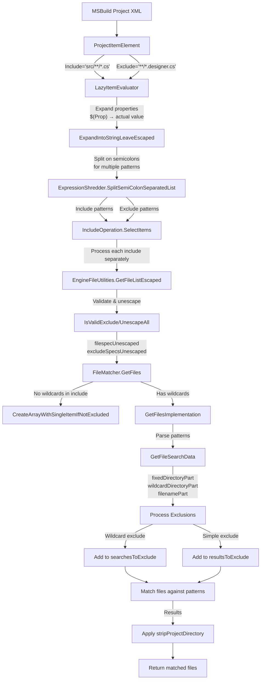

# MSBuild Item Handling

[NOTE: This document is still being fully vetted.]

This document shows how MSBuild processes item includes and excludes from XML to file matching.

## How Include/Exclude Patterns Flow Through MSBuild

1. **Starting Point**: When you define items in a project file:
   ```xml
   <ItemGroup>
     <Compile Include="src/**/*.cs" Exclude="**/*.designer.cs" />
   </ItemGroup>
   ```

2. **Pattern Splitting**: 
   - Multiple patterns separated by semicolons are split
   - Each include pattern is processed individually
   - All exclude patterns are applied to each include result

3. **Pattern Processing**:
   - Include pattern → Matched files → Filtered by excludes → Final list

## How Globbing Actually Works

MSBuild breaks down each pattern into three parts:

```
src/foo/**/*.cs
  |      |    |
  |      |    └── File part (*.cs)
  |      └─────── Wildcard directory part (**/*)
  └────────────── Fixed directory part (src/foo/)
```

### Supported Wildcards

MSBuild only natively supports three wildcards:
- `*` - Matches zero or more characters (except directory separators)
- `**` - Matches zero of more directories
- `?` - Matches exactly one character

Note that `[]` (character classes) and `{}` (brace expansion) are **not** natively supported. The code explicitly escapes these characters in the regular expressions.

`..` is not allowed in specs past the first wildcard and `**` **must** be surrounded by separators (`**\` at the beginning, `\**\` in the middle, `\**` at the end).

By default, `**` patterns are not allowed at a file system root (`C:\**` on Windows and `/**` on Unix based systems).

### File Matching Decision Tree

MSBuild uses different matching strategies depending on the pattern:

1. **No wildcards at all**: Direct path comparison (fastest)
2. **Only filename wildcards**: Directory listing with name matching
3. **Special `**/{pattern}/**` optimization**: Directory name matching
4. **Complex wildcards**: Regular expression matching (slowest)


## Exclude Handling

For exclude patterns:

1. **Simple Exclude** (no wildcards)
   - Unescaped specs are compared first for a fast match (case insensitive)
       - All leading and trailing separators are ignored
       - Separators are considered equivalent
   - Falls back to a full file match
       - Tries to expand include 8.3 filenames (looks for `~` and walks directory on all platforms)
       - If the spec is considered invalid, skips it.

2. **Wildcard Exclude**: Processed through the same pattern matching system
   - Non-wildcard includes are excluded if they match any wildcard exclude
   - Matching is based on path comparison, not file existence
   - Excludes are applied based on directory relationships (parent/child)

## Existence Checking

- MSBuild doesn't check file existence for non-wildcard includes or excludes
- Paths are matched based on pattern matching, not file system state
- This allows including files that don't exist yet (e.g., generated files)

## Flow Diagram



## Flow Details

### 1. XML Parsing and Initial Processing

- **ProjectItemElement** parses `<Compile Include="..." Exclude="..."/>` attributes
- Attributes are accessed through `.Include` and `.Exclude` properties

### 2. Property and Item Reference Expansion

- **LazyItemEvaluator.IncludeOperation** processes the attributes
- **_expander.ExpandIntoStringLeaveEscaped** expands:
  - Properties: `$(Prop)` → actual value
  - Item references: `@(Item)` → item list
- **ExpressionShredder.SplitSemiColonSeparatedList** splits multi-patterns:
  - `"src/**/*.cs;lib/*.cs"` → `["src/**/*.cs", "lib/*.cs"]`

### 3. Validation and Unescaping

- **EngineFileUtilities.GetFileListEscaped** processes each pattern
- **IsValidExclude** filters out empty/whitespace patterns
- **EscapingUtilities.UnescapeAll** converts escaped characters:
  - `%24` → `$`, `%25` → `%`, etc.

### 4. FileMatcher Processing

- **FileMatcher.GetFiles** receives:
  - `directoryUnescaped`: Project directory 
  - `filespecUnescaped`: Single Include pattern
  - `excludeSpecsUnescaped`: List of Exclude patterns

### 5. Pattern Optimization

- Non-wildcard patterns use fast path (**CreateArrayWithSingleItemIfNotExcluded**)
- Wildcard patterns use **GetFilesImplementation**

### 6. Pattern Parsing and Matching

- **GetFileSearchData** breaks patterns into components:
  - `fixedDirectoryPart`: Non-wildcard directory prefix (e.g., `"src/"` in `"src/**/*.cs"`)
  - `wildcardDirectoryPart`: Directory wildcard part (e.g., `"**/"` in `"src/**/*.cs"`)
  - `filenamePart`: File pattern (e.g., `"*.cs"` in `"src/**/*.cs"`)

### 7. Exclusion Processing

- Each exclude pattern is processed through **GetFileSearchData**
- Simple excludes (no wildcards) added to `resultsToExclude` HashSet
- Complex excludes (with wildcards) added to `searchesToExclude` list

### 8. Directory Relationship Analysis

- Paths analyzed to determine relationship between include/exclude base directories
- Excludes that don't apply to include path are skipped

### 9. Path Transformation

- `stripProjectDirectory` is calculated based on pattern type
  - **Set to `true` when**:
    - Pattern starts with `**\` with no fixed directory part
    - Pattern is relative (not rooted) with no fixed directory part
    - This is determined in `GetFileSearchData` method
  - **Remains `false` when**:
    - Pattern has a fixed directory part (e.g., `src/**/*.cs`)
    - Pattern is an absolute/rooted path (e.g., `C:/project/**/*.cs`)
    - Pattern is used with a different base directory than the project directory
    - This preserves the directory structure in the results
  - **Effect on returned paths**:
    - When `true`: Paths are returned relative to the project directory
    - When `false`: Paths are returned as full paths or with original structure
  - **Special cases**:
    - For files outside the project directory, always `false`
    - For input with combined base paths, derived from the composition
    - Can be explicitly overridden in some API entry points

### 10. Result Filtering

- Files matching any exclude pattern are removed from results
- Path normalization ensures consistent handling of directory separators


## Noted Issues

### FileMatcher.GetLongPathName

- Always runs on all platforms
- Uses Windows specific rooting logic
- Always considers the root to be the current working directory
- Path.GetFullPath will do the expansion logic on Windows
- Expansions are done on includes, but not excludes
- Called for fixed directory part and non-wildcard include specs (via FileMatch)
